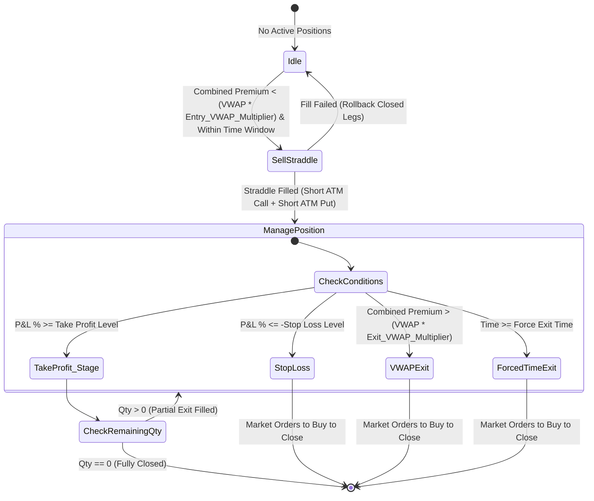

# Numatix — Multi-Account Algorithmic Options Trading Platform

An automated, multi-threaded index options trading platform designed for Interactive Brokers (IBKR) using the official `ibapi` client. The system executes a short volatility (premium harvesting) strategy, manages multiple strategy instances (strikes/offsets) simultaneously, persists positions in isolated SQLite databases, and provides a secure Streamlit-based web dashboard (protected by **bcrypt passwords** and **2FA TOTP**) for live monitoring and real-time operations.

---

## 📝 Table of Contents
- [🌟 Overview](#-overview)
- [⚙️ How the Project Works](#-how-the-project-works)
  - [High-Level Flow](#high-level-flow)
  - [Core Components](#core-components)
- [🔒 Capabilities & Rules](#-capabilities--rules)
  - [Authentication](#authentication)
  - [Bot and Dashboard](#bot-and-dashboard)
  - [Data and State](#data-and-state)
- [🏗️ System Architecture](#️-system-architecture)
- [📈 The Short Straddle Strategy](#-the-short-straddle-strategy)
  - [Data Merging & Premium Calculation](#data-merging--premium-calculation)
  - [Volume-Weighted Average Price (VWAP)](#volume-weighted-average-price-vwap)
  - [Strategy Execution & Signal Generation](#strategy-execution--signal-generation)
- [⚙️ Configuration Files](#-configuration-files)
- [🔑 Adding a User (Auth Setup)](#-adding-a-user-auth-setup)
- [🚀 Running the App](#-running-the-app)
- [🔧 Customization and Automation](#-customization-and-automation)
  - [Adding or Changing a User](#adding-or-changing-a-user)
  - [Adding a New Dashboard Page](#adding-a-new-dashboard-page)
  - [Changing or Extending the Strategy](#changing-or-extending-the-strategy)
  - [Changing Broker or API](#changing-broker-or-api)
  - [Automating Bot Start/Stop (cron/systemd)](#automating-bot-startstop-eg-cron-or-systemd)
  - [Adding a New Config Profile or Account](#adding-a-new-config-profile-or-account)
  - [Database and Positions](#database-and-positions)
  - [Auth and Security Customization](#auth-and-security)
- [📁 Comprehensive File Layout](#-comprehensive-file-layout)

---

## 🌟 Overview

The platform specializes in automated **Short Straddle** trading of Index options (e.g., SPX/SPXW) to harvest option premium. Key capabilities:
*   **Multi-Account Execution**: Connect and trade across multiple IBKR accounts using nicknames resolved from `accounts.json`.
*   **Multi-Strategy Offset Ranges**: Run several strategies concurrently on different option strike offsets (e.g., ATM, ATM-1, ATM+1) in separate threads.
*   **Dynamic Risk Controls**: Hedge positions with Out-of-the-Money (OTM) options, and apply multi-tier Take Profit exits, stop-loss triggers, and global account drawdown limits.
*   **Streamlit Web Interface**: Real-time position tracking, live P&L reporting, interactive configuration editing, and dynamic Premium/VWAP graphs.

---

## ⚙️ How the Project Works

### High-Level Flow

1.  **Dashboard (Streamlit)**  
    You run `streamlit run app.py`. You log in with your **username**, **password**, and **6-digit 2FA code**. After successful authentication, the Options Strategy Dashboard becomes accessible (tabs: Config Editor, Positions Viewer, Historical Data) allowing you to start, pause, or stop bot instances.
2.  **Trading Bot (`main.py`)**  
    From the dashboard, choose an **account** (nickname), **symbol** (e.g., SPX, XSP), and **strike range**. Clicking "Start Strategy" launches a **separate subprocess** running `main.py` with those arguments. That process connects to IBKR, runs the strategy logic, and writes positions to a per-account, per-symbol SQLite DB.
3.  **Auth**  
    Stored securely in `auth.json`. Passwords are **bcrypt-hashed**. 2FA uses **TOTP** (e.g. Google Authenticator/Authy) with a secret stored per user in `auth.json`.
4.  **State and Data**  
    *   `strategy_state.json`: Pause/stop flags per account+symbol (shared by dashboard and bot).
    *   `bot.{account}.{symbol}.pid` / `bot.{account}.{symbol}.status`: Subprocess and health tracking.
    *   `positions_{account}_{symbol}.db`: SQLite database storing active and historical trades.
    *   `config.json` / `config_{nickname}.json`: Contains parameters for broker, underlying, trade limits, timezone, and exit rules.

### Core Components

| Component | Role |
| :--- | :--- |
| **[app.py](file:///c:/Users/vedan/Desktop/projects/240new/app.py)** | Main entry point. Handles login (username + password + 2FA), then loads the dashboard. **Always run this**, not `frontend.py` directly. |
| **[frontend.py](file:///c:/Users/vedan/Desktop/projects/240new/frontend.py)** | Dashboard UI: start/stop bot, config editor, positions, historical data. Protected by `st.session_state["authenticated"]`. |
| **[auth.py](file:///c:/Users/vedan/Desktop/projects/240new/auth.py)** | Loads `auth.json`, verifies passwords using `bcrypt` and TOTP codes via `pyotp`. Used by `app.py`. |
| **[setup_auth.py](file:///c:/Users/vedan/Desktop/projects/240new/setup_auth.py)** | CLI script to create/modify users. It hashes passwords and generates TOTP keys. |
| **[main.py](file:///c:/Users/vedan/Desktop/projects/240new/main.py)** | Bot process: parses range parameters, constructs `StrategyManager`, and spawns per-offset `Strategy` threads. |
| **[strategy/strategy.py](file:///c:/Users/vedan/Desktop/projects/240new/strategy/strategy.py)** | Single-strike strategy execution loop (entry/exit, VWAP, take-profit, stop-loss, hedging). |
| **[broker/strategy_broker.py](file:///c:/Users/vedan/Desktop/projects/240new/broker/strategy_broker.py)** | Thread-safe wrapper around IBKR connection; shared by all strategy threads. |
| **[db/position_db.py](file:///c:/Users/vedan/Desktop/projects/240new/db/position_db.py)** | Handles SQLite connection, schema definition, and position records for a single bot process. |
| **[db/multi_account_db.py](file:///c:/Users/vedan/Desktop/projects/240new/db/multi_account_db.py)** | Scans and queries across all `positions_*.db` files for the Streamlit dashboard views. |
| **[helpers/state_manager.py](file:///c:/Users/vedan/Desktop/projects/240new/helpers/state_manager.py)** | Thread-safe read/write operations for pause/stop flags in `strategy_state.json`. |

---

## 🔒 Capabilities & Rules

### Authentication
*   **Login**: Username + password (plain text input) + 6-digit TOTP code.
*   **Passwords**: Stored in `auth.json` as **bcrypt hashes**. Plain text passwords are never saved.
*   **2FA**: Time-based One-Time Passwords (TOTP). Each user has a unique base32 `totp_secret` in `auth.json` to load into an authenticator app.
*   **Session Security**: `st.session_state["authenticated"]` is set to `True` **only after** successful 2FA verification.
*   **Brute-Force Protection**: Limit of **5 OTP attempts** per login session. Exceeding this locks the session, requiring a page refresh.
*   **Dashboard Security**: If not authenticated, the main dashboard and the Premium VWAP Graph page block view access and show an warning.

### Bot and Dashboard
*   Only **one bot process** can run per **(account, symbol)** combination. Re-starting an already running pair is blocked.
*   **Account Names**: Nicknames used in the UI (e.g. `Vedansh`, `default`) map to their corresponding `ibkr_account_id` defined in `accounts.json`.
*   **Config Profiles**: Config is resolved dynamically per-profile (`config_{nickname}.json`). The dashboard reads and writes configurations for the active profile.
*   **Strike Range**: Strike offsets are relative to the rounded ATM price (e.g., range `4-10` maps to strike offsets `[4, 5, 6, 7, 8, 9, 10]`). An exclusion list (e.g., `-1,1`) can filter specific offsets.

### Data and State
*   **Positions Storage**: Active and historical positions are kept in `positions_{account}_{symbol}.db` SQLite files.
*   **State Control**: Pause and Stop flags are parsed from `strategy_state.json` under `{account}_{symbol}` keys. Bot threads poll this state to react dynamically.

---

## 🏗️ System Architecture


### Thread-Safe Connection Pooling
Rather than opening multiple connections to Interactive Brokers, the platform uses a thread-safe connection pooling design:
1.  **IBBroker (`ib_broker.py`)**: Inherits from the official `EWrapper` and `EClient` classes.
2.  **StrategyBroker (`strategy_broker.py`)**: Wrap operations in locks (`_broker_lock`, `counter_lock`) to coordinate request IDs and API calls safely.
3.  **Cache Updater Thread (`PnLCacheUpdater`)**: Refreshes account position data globally every 10 seconds. All running strategy threads read from this cache, preventing concurrent socket calls and avoiding IBKR request rate-limiting.

---

## 📈 The Short Straddle Strategy

### Data Merging & Premium Calculation
1.  Fetches option OHLC bars for Call and Put options.
2.  Merges Call and Put OHLC bars by timestamp.
3.  Calculates **Combined Premium**: $Premium_{combined} = Price_{call\_close} + Price_{put\_close}$
4.  Calculates **Combined Volume**: $Volume_{combined} = Volume_{call} + Volume_{put}$
5.  Filters out zero-volume bars to obtain a clean data series.

### Volume-Weighted Average Price (VWAP)
The strategy computes a cumulative Session VWAP of the combined option premiums:
$$VWAP = \frac{\sum (Premium_{combined} \times Volume_{combined})}{\sum Volume_{combined}}$$
This VWAP acts as the baseline value of the options combination for the trading day.

### Strategy Execution & Signal Generation



1.  **Entry Signal (`SELL_STRADDLE`)**:
    *   Triggered when no positions are open, spreads are within the `max_bid_ask_spread` limit, and:
        $$\text{Combined Premium} < \text{Session VWAP} \times \text{entry\_vwap\_multiplier}$$
    *   Simultaneously sells At-the-Money (ATM) Calls and ATM Puts at the selected strike offset.
    *   If `enable_hedges` is active, it simultaneously buys Out-of-the-Money (OTM) Calls and Puts at configured offsets to limit downside risk.
2.  **Take Profit (TP) Levels (Fractional Exits)**:
    *   Supports multi-tier fractional exits defined in the configuration (e.g. exit 50% of the position when P&L hits +10%, exit 30% when P&L hits +40%, exit the final 20% at +50% profit).
    *   Updates remaining quantities and recalculates average exit prices in the database dynamically.
3.  **Stop Loss (SL) Exit**:
    *   Triggers if the combined unrealized P&L percentage drops below the negative `-stop_loss` threshold. All legs are closed immediately.
4.  **VWAP Exit**:
    *   Triggers if the combined option premium rises above a critical threshold:
        $$\text{Combined Premium} > \text{Session VWAP} \times \text{exit\_vwap\_multiplier}$$
5.  **Forced Time Exit**:
    *   To avoid overnight risk, all active positions are closed when market time hits the configured `force_exit_time` (e.g., 15:10 EST).

---

## ⚙️ Configuration Files

### 1. `config.json` / `config_{nickname}.json`
Contains connection, underlying contract info, execution, and risk bounds:
*   `broker`: host, port, and client ID.
*   `underlying`: contract parameters (symbol, exchange, multiplier, trading class e.g., `SPXW`).
*   `trade_parameters`: quantities, VWAP multipliers, take profit schedules, stop loss limits, drawdown and profit targets.
*   `time_controls`: trade time windows and timezones.
*   `hedging`: offsets and quantities for OTM protective legs.

### 2. `accounts.json`
Maps user-friendly nicknames to IBKR account IDs (used for database filenames and API routing).
```json
{
  "accounts": [
    { "nickname": "Vedansh", "ibkr_account_id": "DUH300582" },
    { "nickname": "default", "ibkr_account_id": "DU1234567" }
  ]
}
```

---

## 🔑 Adding a User (Auth Setup)

Do not edit `auth.json` by hand for passwords. Instead, use the security CLI script to hash credentials correctly.

### Step 1: Run the setup script
From the project root:
```bash
python setup_auth.py
```

### Step 2: Input Credentials
You will be prompted for:
1.  **Username**: Typed during dashboard login.
2.  **Password**: Hashed using `bcrypt` and written to `auth.json`.
3.  **TOTP secret**: Paste an existing base32 string, or press **Enter** to generate a new key.

### Step 3: Add to Authenticator App
Load the generated base32 TOTP secret key into Google Authenticator, Authy, or Microsoft Authenticator to generate the 6-digit login codes.

---

## 🚀 Running the App

### 1. Install Dependencies
```bash
pip install -r requirements.txt
```

### 2. Start the Streamlit Dashboard (with login)
```bash
streamlit run app.py
```
Open [http://localhost:8501](http://localhost:8501) in your browser. Enter your username, password, and the current 6-digit code from your authenticator app. Use the dashboard UI to launch strategies, adjust configs, and view positions.

### 3. Running the Bot Manually
The Streamlit app launches bot processes as background subprocesses, but you can also execute them directly in your shell for debugging:
```bash
# General structure:
# python main.py --account <NICKNAME> --symbol <SYMBOL> --config <CONFIG_PATH> --range <START:END>
python main.py --account Vedansh --symbol SPX --config config_Vedansh.json --range 4-10
```

---

## 🔧 Customization and Automation

### Adding or Changing a User
Run `python setup_auth.py` again. Entering an existing username will overwrite their password hash and TOTP secret, merging changes into `auth.json`.

### Adding a New Dashboard Page
Create a Python file under the `pages/` directory (e.g. `pages/3_Analytics.py`). To protect the page, enforce authentication at the top of the file:
```python
import streamlit as st

if not st.session_state.get("authenticated", False):
    st.warning("Please log in via the main app to access this page.")
    st.stop()
```
Streamlit will automatically display this page in the sidebar menu.

### Changing or Extending the Strategy
*   **Logic Adjustments**: Open `strategy/strategy.py`. Modify `run()` cycles, order placement routines, VWAP calculations, or exit thresholds.
*   **New Parameters**: Add parameter fields in the config JSON files, load them in `Strategy.load_config()`, and reference them inside your strategy class.
*   **Alternative Strategies**: Create a new strategy class file under `strategy/` (e.g. `strategy/straddle_alt.py`). Import it in `main.py` and modify constructing logic under `StrategyManager` to launch the alternative runner.

### Changing Broker or API
Adapt trade interfaces in `broker/` (`ib_broker.py` or `strategy_broker.py`). Note that `strategy_broker.py` functions as the unified point utilized by all strategy threads. Make sure to keep all methods thread-safe.

### Automating Bot Start/Stop (e.g., cron or systemd)
*   **Start**: Run `main.py` directly with required CLI parameters. Ensure it executes in the root directory so local configs and databases resolve properly.
*   **Stop**: Either terminate the process using the PID stored in `bot.{account}.{symbol}.pid` or modify `strategy_state.json` to mark the pair as stopped (the bot thread queries this file every 2 seconds and exits gracefully).

### Adding a New Config Profile or Account
1.  **Account**: Add a dictionary to `accounts.json` containing the nickname and IBKR account identifier.
2.  **Config**: Create `config_{nickname}.json` by copying `config.json`, or initialize it inside the dashboard's "Config Editor" tab.

### Database and Positions
*   **Database Schema**: Defined in `db/position_db.py` inside `PositionDB._init_db()`. Database structure updates can be coded as `ALTER TABLE` blocks inside a `try/except` clause.
*   **Cross-Account Queries**: Use `MultiAccountDB` which automatically scans for files matching `positions_*.db` in the root workspace.

### Auth and Security
*   **Rate Limiting**: Attempt limits can be customized in `app.py` under the `_render_otp_step(max_attempts=5)` configuration.
*   **TOTP Window**: Modify `verify_totp(..., valid_window=1)` in `auth.py`. Adjusting `valid_window` expands or restricts time drift tolerance.

---

## 📁 Comprehensive File Layout

```
├── app.py                 # Main application entry (login gate + loads dashboard)
├── frontend.py            # Dashboard UI tabs (rendered by app.py upon authentication)
├── main.py                # Bot CLI orchestrator (spawns strategy instances and checks limits)
├── auth.py                # Core authentication functions (bcrypt hashes & pyotp validation)
├── setup_auth.py          # Interactive script to add users and hash passwords
├── auth.json              # Hashed passwords, username dictionary, and TOTP secrets
├── accounts.json          # Nickname to IBKR account ID mapping definitions
├── config.json            # Default system settings and threshold configurations
├── config_*.json          # Account-specific override configuration profiles
├── strategy_state.json    # Pause/stop state flags per account-symbol combination
├── positions_*.db         # SQLite databases representing positions per account-symbol
├── bot.*.pid              # Process ID file tracking active bot instances
├── bot.*.status           # Human-readable execution status of active bots
├── broker/
│   ├── __init__.py
│   ├── ib_broker.py       # Direct connection adapter using python-api ibapi
│   ├── ibkr_broker.py     # Deprecated/alternative connection adapter using ib-insync library
│   └── strategy_broker.py # Thread-safe StrategyBroker facade wrapper with caching
├── db/
│   ├── __init__.py
│   ├── multi_account_db.py# Aggregator scanning positions across multiple databases
│   └── position_db.py     # Handles local SQLite connections and schema initialization
├── helpers/
│   ├── __init__.py
│   ├── graph_generator.py # Real-time Premium and VWAP graph plotting methods
│   ├── index_price.py     # Simple wrapper to fetch underlying prices
│   ├── positions.py       # Quantities normalizer and active position restoration
│   └── state_manager.py   # State accessor logic for strategy_state.json
├── logs/                  # System log directory
├── signals/               # Date-stamped folders hosting signals.csv logs
└── requirements.txt       # Project python packages listing
```
