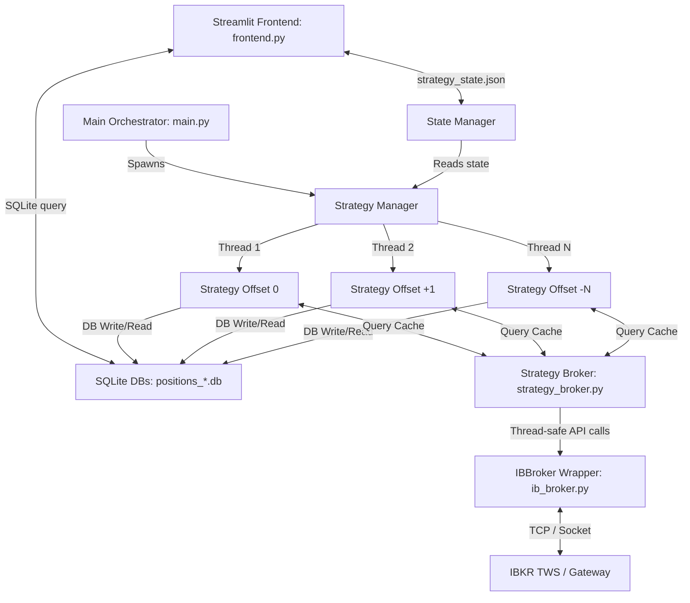
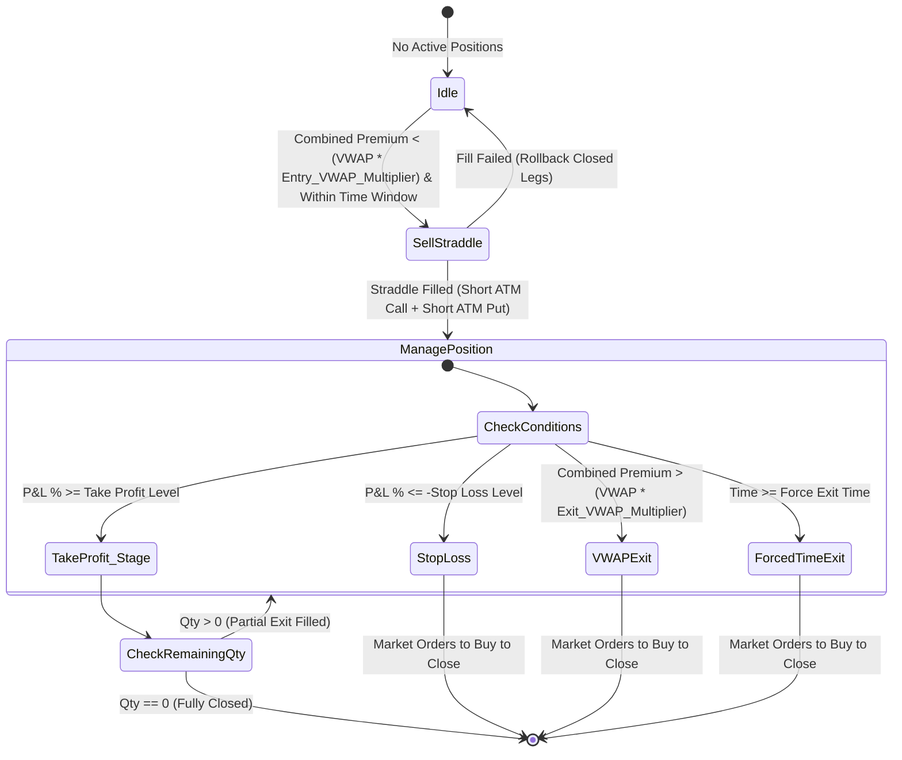

# Multi-Account Algorithmic Options Trading Platform

An automated, multi-threaded index options trading platform designed for Interactive Brokers (IBKR) using the official ibapi client. The platform runs a short volatility (premium harvesting) strategy, manages multiple strategy instances (strikes/offsets) simultaneously, persists positions in isolated SQLite databases, and provides a Streamlit-based web dashboard for live monitoring and real-time operations.

---

## 🌟 Overview

The platform specializes in automated **Short Straddle** trading of Index options (e.g., SPX/SPXW) to harvest option premium. It supports:
*   **Multi-Account Execution**: Connect and trade across multiple IBKR accounts using nicknames resolved from `accounts.json`.
*   **Multi-Strategy Offset Ranges**: Run several strategies concurrently on different option strike offsets (e.g., ATM, ATM-1, ATM+1) in separate threads.
*   **Dynamic Risk Controls**: Hedge positions with Out-of-the-Money (OTM) options, and apply multi-tier Take Profit exits, stop-loss triggers, and global account drawdown limits.
*   **Streamlit Web Interface**: Real-time position tracking, live P&L reporting, interactive configuration editing, and dynamic Premium/VWAP graphs.

---

## 🏗️ System Architecture

The project is designed with a clear separation of concerns, separating the Streamlit UI frontend, the orchestration main loop, the individual strategy runners, and the thread-safe connection to the broker:



### 1. Main Orchestrator (`main.py`)
*   Parses startup arguments (account, symbol override, strike range configuration, exclusion offsets).
*   Spawns `StrategyManager` to orchestrate multiple strategies.
*   Resolves account nicknames to IBKR IDs using [accounts.json](file:///c:/Users/vedan/Desktop/projects/240new/accounts.json).
*   Initiates a background `PnLLimitChecker` thread checking global account P&L every 30 seconds, automatically stopping all strategies if global drawdown or profit limit targets are breached.

### 2. Strategy Runner (`strategy/strategy.py`)
*   Contains the core trading loop (`Strategy` class) executed in its own dedicated thread.
*   Loads strategy parameters from [config.json](file:///c:/Users/vedan/Desktop/projects/240new/config.json).
*   Fetches market data, calculates session indicators (VWAP, spreads), generates trading signals, places trades, and monitors open legs.
*   Logs signals dynamically to CSV files under `signals/<date>/` directory.

### 3. Thread-Safe Broker Wrapper (`broker/strategy_broker.py` & `broker/ib_broker.py`)
*   [ib_broker.py](file:///c:/Users/vedan/Desktop/projects/240new/broker/ib_broker.py) handles the raw connection with the Interactive Brokers API using `EClient` and `EWrapper`.
*   [strategy_broker.py](file:///c:/Users/vedan/Desktop/projects/240new/broker/strategy_broker.py) provides a thread-safe broker facade wrapper using locks.
*   **Performance Optimization**: Implements a single background thread (`PnLCacheUpdater`) refreshing a shared P&L list every 10 seconds. All active strategy threads pull from this cache instead of calling IBKR concurrently, preventing rate-limiting issues and socket contention.

### 4. Database Schema (`db/position_db.py` & `db/multi_account_db.py`)
*   Utilizes a local SQLite database per account-symbol combination (e.g. `positions_default_SPX.db`). This prevents SQLite database lock-contention across threads.
*   Stores critical trade history details: `initial_qty`, `qty`, `entry_time`, `exit_time`, `entry_price`, `close_price`, `bid`, `ask`, `last_price`, order IDs, `realized_pnl`, and `unrealized_pnl`.

---

## 📈 The Short Straddle Strategy

### Data Merging & Premium Calculation
For option premium harvesting, the strategy focuses on the combined premium of Call and Put options at the chosen strike price.
1.  Fetches option OHLC bars for Call and Put options.
2.  Merges Call and Put OHLC bars by timestamp.
3.  Calculates **Combined Premium**: $Premium_{combined} = Price_{call\_close} + Price_{put\_close}$
4.  Calculates **Combined Volume**: $Volume_{combined} = Volume_{call} + Volume_{put}$
5.  Filters out zero-volume bars to obtain a clean data series.

### Volume-Weighted Average Price (VWAP)
The strategy computes a cumulative Session VWAP of the combined option premiums:
$$VWAP = \frac{\sum (Premium_{combined} \times Volume_{combined})}{\sum Volume_{combined}}$$
This VWAP acts as the baseline value of the options combination for the trading day.

### Strategy Execution & Signal Generation



1.  **Entry Signal (`SELL_STRADDLE`)**:
    *   Triggered when no positions are open, spreads are within the `max_bid_ask_spread` limit, and:
        $$\text{Combined Premium} < \text{Session VWAP} \times \text{entry\_vwap\_multiplier}$$
    *   Simultaneously sells At-the-Money (ATM) Calls and ATM Puts at the selected strike offset.
    *   If `enable_hedges` is active, it simultaneously buys Out-of-the-Money (OTM) Calls and Puts at configured offsets to limit downside risk.
2.  **Take Profit (TP) Levels (Fractional Exits)**:
    *   Supports multi-tier fractional exits defined in the configuration (e.g. exit 50% of the position when P&L hits +10%, exit 30% when P&L hits +40%, exit the final 20% at +50% profit).
    *   Updates remaining quantities and recalculates average exit prices in the database dynamically.
3.  **Stop Loss (SL) Exit**:
    *   Triggers if the combined unrealized P&L percentage drops below the negative `-stop_loss` threshold. All legs are closed immediately.
4.  **VWAP Exit**:
    *   Triggers if the combined option premium rises above a critical threshold:
        $$\text{Combined Premium} > \text{Session VWAP} \times \text{exit\_vwap\_multiplier}$$
5.  **Forced Time Exit**:
    *   To avoid overnight risk, all active positions are closed when market time hits the configured `force_exit_time` (e.g., 15:10 EST).

---

## ⚙️ Configuration Files

### 1. `config.json`
Specifies default trade parameters, risk tolerances, and broker connection settings.
```json
{
  "broker": {
    "host": "127.0.0.1",
    "port": 7497,
    "client_id": 1
  },
  "underlying": {
    "symbol": "SPX",
    "exchange": "SMART",
    "currency": "USD",
    "trading_class": "SPXW",
    "multiplier": 100
  },
  "expiry": {
    "date": "20260213"
  },
  "trade_parameters": {
    "call_quantity": 1,
    "put_quantity": 1,
    "entry_vwap_multiplier": 0.99,
    "exit_vwap_multiplier": 1.02,
    "take_profit_levels": [
      { "pnl_percent": 0.1, "exit_percent": 0.5 },
      { "pnl_percent": 0.4, "exit_percent": 0.3 },
      { "pnl_percent": 0.5, "exit_percent": 0.2 }
    ],
    "stop_loss": 0.10,
    "max_bid_ask_spread": 1.05,
    "strike_step": 5,
    "drawdown_limit": 5000,
    "profit_limit": 5000
  },
  "time_controls": {
    "entry_start": "09:30",
    "entry_end": "14:30",
    "force_exit_time": "15:10",
    "timezone": "US/Eastern"
  },
  "hedging": {
    "enable_hedges": true,
    "hedge_call_offset": 5,
    "hedge_put_offset": -5,
    "hedge_quantity": 1
  }
}
```

### 2. `accounts.json`
Maps multiple local account nicknames to their respective IBKR account identifiers.
```json
{
  "accounts": [
    {
      "nickname": "default",
      "ibkr_account_id": "DU1234567"
    }
  ]
}
```

---

## 📁 Directory Structure

```
├── broker/
│   ├── __init__.py
│   ├── ib_broker.py         # Raw IBKR connection handling (EWrapper/EClient implementation)
│   ├── ibkr_broker.py       # Alternative broker connection module using ib-insync library
│   └── strategy_broker.py   # Thread-safe StrategyBroker facade wrapper with cache management
├── db/
│   ├── __init__.py
│   ├── multi_account_db.py  # Utility functions to manage multiple SQLite DB instances
│   └── position_db.py       # Sqlite3 position persistence & P&L calculation methods
├── helpers/
│   ├── __init__.py
│   ├── graph_generator.py   # Real-time Premium VWAP graph plotting helper
│   ├── index_price.py       # Spot index price helper
│   ├── positions.py         # Position normalization and mapping helpers
│   └── state_manager.py     # Thread-safe JSON state reader/writer (pause/stop flags)
├── pages/
│   └── 2_Premium_VWAP_Graph.py  # Streamlit VWAP Graph page
├── strategy/
│   ├── __init__.py
│   └── strategy.py          # Short Straddle execution loop logic
├── signals/                 # Automated daily directories containing signals.csv logs
├── main.py                  # Core backend orchestrator, strike parser, and PnLLimitChecker
├── frontend.py              # Streamlit dashboard entry point
├── config.json              # Trading parameter configuration file
├── accounts.json            # Account nicknames to IBKR IDs file
└── requirements.txt         # Project package requirements list
```

---

## 🚀 Getting Started

### Prerequisites
1.  **Python**: Version 3.8 to 3.11 is recommended.
2.  **Interactive Brokers Trader Workstation (TWS) or IB Gateway**: Ensure TWS or Gateway is running locally, API connections are enabled, and the port matches [config.json](file:///c:/Users/vedan/Desktop/projects/240new/config.json) (typically `7497` for Paper trading, `7496` for Live trading).

### Installation
Clone the project repository, set up a virtual environment, and install dependencies:
```bash
# Setup virtual environment
python -m venv venv
venv\Scripts\activate

# Install requirements
pip install -r requirements.txt
```

### Running the Backend Engine
Run [main.py](file:///c:/Users/vedan/Desktop/projects/240new/main.py) to launch the trading engine. You can specify strike ranges using `--range` and filter offsets using `--exclude`:
```bash
# Run strategy for ATM strike (offset 0)
python main.py --account default --symbol SPX

# Run strategies for offset range [-2, -1, 0, 1, 2] in parallel threads
python main.py --account default --range -2:2

# Run strategies for offset range [-3 to 3] excluding offset -1 and 1
python main.py --account default --range -3:3 --exclude -1,1
```

### Running the Streamlit Web UI
Start the Streamlit web dashboard in a separate terminal:
```bash
streamlit run frontend.py
```
Open the provided local URL (usually `http://localhost:8501`) to inspect your dashboard, modify configurations, check live/historical P&L, pause/resume strategies, or review real-time Premium VWAP graphs.
